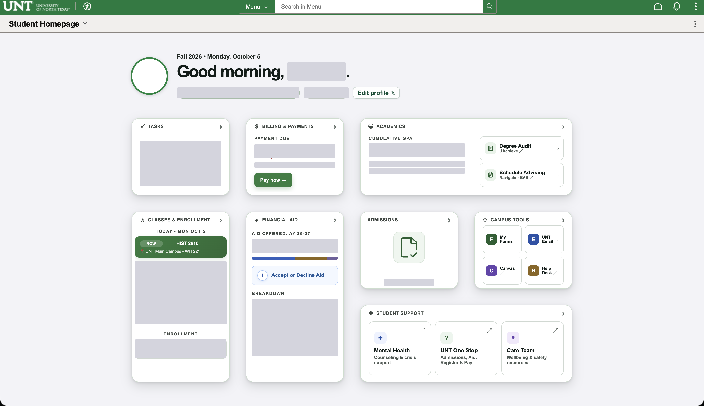
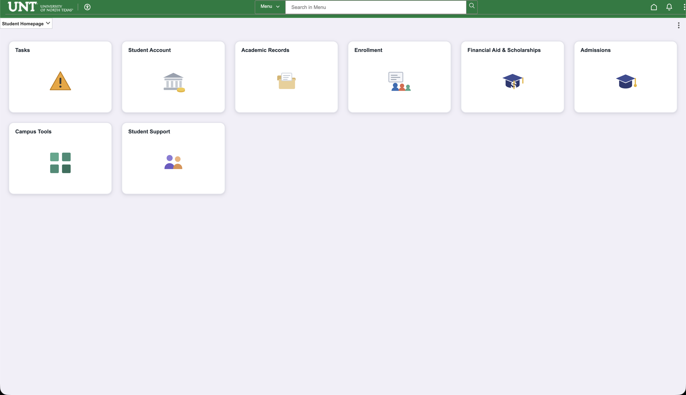

# classic-unt

A browser extension that restyles the [my.unt.edu](https://my.unt.edu) homepage.

[](https://github.com/KaushikDuddala/classic-unt/actions/workflows/ci.yml) [](https://github.com/KaushikDuddala/classic-unt/releases/latest) [](LICENSE)

Works in **Chrome**, **Firefox** and **Safari**. (currently not on any official stores).

## What it does

| Mode | Result |
| --- | --- |
| **Option 1: Hide the specifics** | Covers personal information in boxes but keeps the layout and design |
| **Option 2: Classic layout** *(default)* | A recreation of the old MyUNT |
| **Off** | just off :) |

<!-- Screenshots. Save the file, then drop the <!-- --> off the front of the line. -->

<!-- #### Option 1: Hide the specifics -->
<!--  -->

<!-- #### Option 2: Classic layout -->
<!--  -->

There's also a seperate option to remove the background and to hide any info.

## Install (or build from source/develop)

works in Chrome, Firefox and Safari, See [Browsers](#browsers).

### Chrome, Edge, Brave, Opera, other chromium-based browsers

I haven't uploaded the extension to the chrome web store yet because it costs money (donate at ____ pwease)

For now, follow the following instructions:

this method works always, a little weirder than a normal install but it's reliable


#### building from source:

1. Download the code from releases > source code (.zip)
2. Unzip the .zip file
3. Open `chrome://extensions`
4. Turn on **Developer mode** (top right)
5. Click **Load unpacked** and select the **`src/`** folder inside the unzipped folder
6. Pin the extension, then click its toolbar icon for quick settings

### Firefox

First, either download the **firefox** extension zip from releases

#### if developing from source:
```sh
npm run build:firefox     # -> dist/classic-unt-firefox.zip
```

Then either:

- **temporarily**, open `about:debugging#/runtime/this-firefox` → *Load Temporary Add-on…* → pick `manifest.json` inside the zip (unzip it first); or
- **permanently**, this no work yet bc it hasn't gotten accepted on the firefox store

### Safari

runs a converter to convert the chrome extension to a safari extension

```sh
npm run build:safari
open "dist/safari/classic-unt/classic-unt.xcodeproj"
```

Then in Xcode choose the **classic-unt Extension (macOS)** scheme and press Run. In Safari enable *Develop → Allow Unsigned Extensions* first. Needs Xcode and Safari 16.4 or newer. You may need to switch Xcode from using a phone to a mac if you've previously used it for iOS development

#### If Xcode fails with "failed to read asset tags"

macOS protects `~/Documents`, `~/Desktop` and `~/Downloads` from other apps, and Xcode's asset compiler (`actool`) runs sandboxed. It gets `EPERM` there and reports it as `The file "Contents.json" couldn't be opened because you don't have permission to view it`.

Either grant Xcode access:

**System Settings → Privacy & Security → Full Disk Access** → add **Xcode**, then quit and reopen Xcode.

Or build somewhere unprotected, by passing an output directory:

```sh
tools/build-safari.sh "$HOME/Developer/classic-unt-safari"
open "$HOME/Developer/classic-unt-safari/safari/classic-unt/classic-unt.xcodeproj"
```

`build-safari.sh` detects the protected folders and warns you up front instead of letting you hit the confusing error.

## Layout

```
src/           the extension. manifest.json here is the Chrome/Chromium one
manifests/     the Firefox and Safari manifests and swapped in at build time
keys/          the signing key. not public ;)
dist/          build outputs
tests/         test harness and screenshots
tools/         build.sh, build-safari.sh
```

Only `src/` is loaded directly, and only `src/` is copied into a package.

## Browsers

The JavaScript and CSS are identical everywhere. Three things differ:

| | Chrome/Edge/Brave | Firefox | Safari |
| --- | --- | --- | --- |
| background | `service_worker` | `scripts` list | `scripts` list |
| add-on id | not needed | `browser_specific_settings.gecko.id` | not used |
| manifest | `src/manifest.json` | `manifests/firefox.json` | `manifests/safari.json` |
| package | `.crx` | `.zip` | Xcode project via `xcrun` |

Two details worth knowing if you edit this code:

- **`background.js` must work without `importScripts`.** Chrome runs the background as a service worker where `importScripts()` exists; Firefox and Safari run it as a background page where it does not, so their manifests list `defaults.js` first instead. The script guards the call.
- **No `:has()` in any stylesheet.** An engine that cannot parse one selector discards *every* selector in that rule, so the failure is silent and looks like an unrelated styling problem. `tests/manifests.test.js` fails the build if one creeps back in. It strips comments first, since the comments mention `:has()` while explaining why it is avoided.

```sh
npm run build            # chrome + firefox
npm run build:chrome
npm run build:firefox
npm run build:safari     # needs Xcode
```

## Building the .crx

```sh
tools/build.sh
```

Signs `src/` with `keys/classic-unt.pem` (creating one on first run) and writes `dist/classic-unt.crx`.


## The three modes

### Option 1: Hide the specifics

Keeps the new design. The personal numbers on the homepage are covered by a solid block until you point at them:

- GPA, academic standing, prior-term GPA
- Balance and payment due date
- Aid offered and the award breakdown
- Today's classes, enrollment cart, enrollment appointment
- Task counts, student ID, name and photo
- Admissions status line

**Hover** to read a value, **click** to keep it visible.

Pick and choose what gets covered in the full options page.

### Option 2: Classic layout (the default)

The old myUNT :D

### Off

Leaves the page exactly as it's made it.

### Background photo

swaps the campus photo for a flat light background.

## Layout of the code

| File | Purpose |
| --- | --- |
| `manifest.json` | MV3 manifest |
| `content.js` | All page logic: redactions, classic tiles, background removal |
| `content.css` | Both themes scoped to `html.classic-unt-*` classes |
| `defaults.js` | Settings defaults shared by the pages and the worker |
| `background.js` | Seeds settings on install |
| `options.html/js/css` | Full settings page |
| `popup.html/js/css` | Toolbar popup: mode, background, reveal |

## Tests

```sh
npm install     # jsdom and js-yaml, and only for the tests
npm test
npm run preview # renders each mode to tests/screenshots/
```

The extension itself has **no dependencies and no build step**. `src/` is plain files that Chrome loads directly. jsdom and js-yaml are dev dependencies of the tests alone.

| File | Covers |
| --- | --- |
| `tests/helpers.js` | Repo-relative paths, assertions, DOM bootstrapping |
| `tests/manifests.test.js` | Every manifest resolves its files, the three agree where they must, versions line up, no `:has()` or unquoted `$` in any selector |
| `tests/forms.test.js` | The issue forms, repo metadata and community files |
| `tests/content.test.js` | `content.js` against the saved page markup: both modes, redaction, click/hover behaviour, tile reordering, settings round-trip, inner frames |
| `tests/ui.test.js` | `options.html` and `popup.html` with their real inline scripts |
| `tests/preview.js` | Screenshots of each mode |
| `tests/preview-pages.js` | Screenshots of the options page and the popup |
| `tests/browser.js` | Browser discovery shared by the scripts above |
| `tests/measure.js` | Fails if a box would be clipped at the edge |

The screenshot and measurement scripts need a Chrome or Chromium. They look in the usual places and honour `CHROME_BIN`; with none found they print a note and exit 0 so they never fail the suite.

Continuous integration runs the assertions on Node 18/20/22/24 and checks the shell scripts with ShellCheck. It builds nothing. Packages are only built by the release workflow, which refuses to publish anything containing a key. Layout measurement runs too, but only as a warning, so a CI image quirk cannot block a pull request.

```sh
npm run check      # everything
```

## Contributing

Pull requests welcome, see [CONTRIBUTING.md](CONTRIBUTING.md). There are three house rules that all fail *quietly* if broken (no `:has()`, no `$` in an unquoted id selector, no build step), and a test enforces the first two.

Publish a release (draft a `v1.2.3` release on the Releases page, then publish it) and the [release workflow](.github/workflows/release.yml) builds the packages and attaches them. It refuses to run if the version numbers disagree with the tag or the changelog has no entry.

## Licence and affiliation

[MIT](LICENSE). Unofficial and not affiliated with the University of North Texas. It renders the page differently in your own browser; it never sends anything anywhere.

[Code of Conduct](.github/CODE_OF_CONDUCT.md) · [Changelog](CHANGELOG.md) · [Report an issue](https://github.com/KaushikDuddala/classic-unt/issues)
